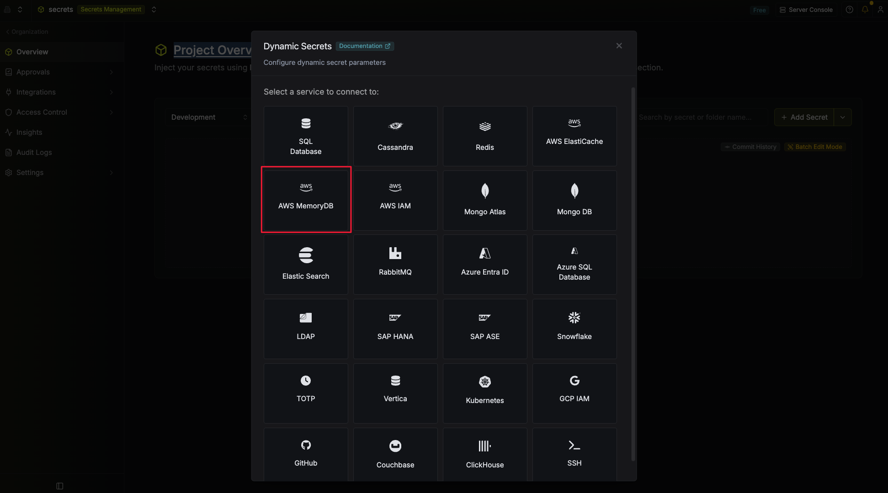
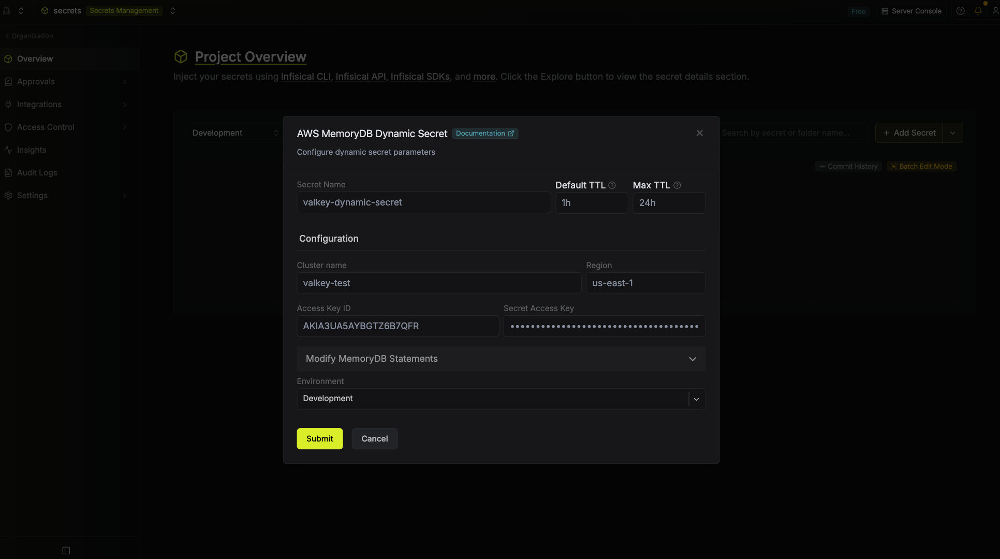

import DynamicSecretUsernameTemplateParamField from "/snippets/documentation/platform/dynamic-secrets/dynamic-secret-username-template-field.mdx";

The Infisical AWS MemoryDB dynamic secret generates short-lived MemoryDB users (Valkey or Redis OSS engine) and attaches them to the ACL already associated with your target cluster. Each lease creates a new MemoryDB user with a fresh password; revocation deletes the user.

## Prerequisites

1. A MemoryDB cluster with an ACL attached. If your cluster is still on the default `open-access` ACL, attach a real ACL before configuring the dynamic secret — Infisical will refuse to add users to a cluster with no ACL.
2. An AWS IAM user (or assumed role) for Infisical to use, with an access key ID and secret access key. Attach the following policy:

```json
{
  "Version": "2012-10-17",
  "Statement": [
    {
      "Effect": "Allow",
      "Action": "memorydb:DescribeClusters",
      "Resource": "*"
    },
    {
      "Effect": "Allow",
      "Action": [
        "memorydb:CreateUser",
        "memorydb:DeleteUser",
        "memorydb:UpdateACL"
      ],
      "Resource": "arn:aws:memorydb:*:*:user/inf-*"
    },
    {
      "Effect": "Allow",
      "Action": "memorydb:UpdateACL",
      "Resource": "arn:aws:memorydb:*:*:acl/*"
    }
  ]
}
```

A few notes on the policy:

- `memorydb:DescribeClusters` doesn't support resource-level scoping, so it must be `"Resource": "*"`.
- The `user/inf-*` pattern matches the `inf-` username prefix Infisical applies to every generated user.
- `memorydb:UpdateACL` is granted on both the user ARN and the ACL ARN because AWS evaluates the action against every resource it touches in a single call (the ACL plus each user being added or removed).
- If you'd like to pin the ACL more tightly, replace `acl/*` with `acl/<your-acl-name>`.

<Note>
  New leases may take a short while to become usable while MemoryDB propagates the user across the cluster's shards. We recommend a retry strategy when first connecting with newly-issued credentials.
</Note>

## Set up Dynamic Secrets with AWS MemoryDB

<Steps>
  <Step title="Open Secret Overview Dashboard">
    Open the Secret Overview dashboard and select the environment in which you would like to add a dynamic secret.
  </Step>
  <Step title="Click on the 'Add Dynamic Secret' button">
    
  </Step>
  <Step title="Select AWS MemoryDB">
    
  </Step>
  <Step title="Provide the inputs for dynamic secret parameters">
    

    <ParamField path="Secret Name" type="string" required>
      Name by which you want the secret to be referenced.
    </ParamField>

    <ParamField path="Default TTL" type="string" required>
      Default time-to-live for a generated secret (this can be changed after the secret is created).
    </ParamField>

    <ParamField path="Max TTL" type="string" required>
      Maximum time-to-live for a generated secret.
    </ParamField>

    <ParamField path="Cluster name" type="string" required>
      The name of the MemoryDB cluster Infisical should provision users for.
    </ParamField>

    <ParamField path="Region" type="string" required>
      The AWS region the MemoryDB cluster lives in (e.g. `us-east-1`).
    </ParamField>

    <ParamField path="Access Key ID" type="string" required>
      Access key ID of the AWS IAM user from the prerequisites.
    </ParamField>

    <ParamField path="Secret Access Key" type="string" required>
      Secret access key of the AWS IAM user from the prerequisites.
    </ParamField>
  </Step>
  <Step title="(Optional) Modify MemoryDB Statements">
    
    {/* TODO: add screenshot of the expanded "Modify MemoryDB Statements" accordion */}

    <DynamicSecretUsernameTemplateParamField />

    <ParamField path="Creation Statement" type="string">
      A JSON payload passed to MemoryDB's `CreateUser` API. `{{username}}` and `{{password}}` are substituted with Infisical-generated values at lease time. Use the `AccessString` field to scope each lease's permissions.

      Default:
      ```json
      {
        "UserName": "{{username}}",
        "AccessString": "on ~* +@all",
        "AuthenticationMode": { "Type": "password", "Passwords": ["{{password}}"] }
      }
      ```
    </ParamField>

    <ParamField path="Revocation Statement" type="string">
      A JSON payload passed to MemoryDB's `DeleteUser` API. `{{username}}` is substituted at revoke time.

      Default:
      ```json
      { "UserName": "{{username}}" }
      ```
    </ParamField>
  </Step>
  <Step title="Click `Submit`">
    Infisical will verify it can reach the cluster with the provided credentials and validate the statements.
  </Step>
  <Step title="Generate dynamic secrets">
    Once configured, click `Generate` on the dynamic secret row (or `New Lease` in the lease list) to provision a lease.

    
    

    Specify a TTL within the configured Max TTL.

    

    The generated username and password are shown once on lease creation.

    
  </Step>
</Steps>

## Audit or Revoke Leases

Click any dynamic secret on the dashboard to see active leases, their expiration times, and revoke them early if needed.


## Renew Leases

Click `Renew` on an active lease to extend its TTL.


<Warning>
  Renewals cannot exceed the Max TTL set when the dynamic secret was configured.
</Warning>
